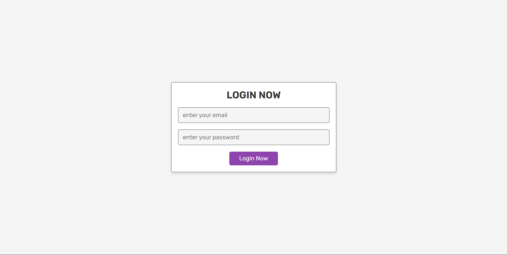
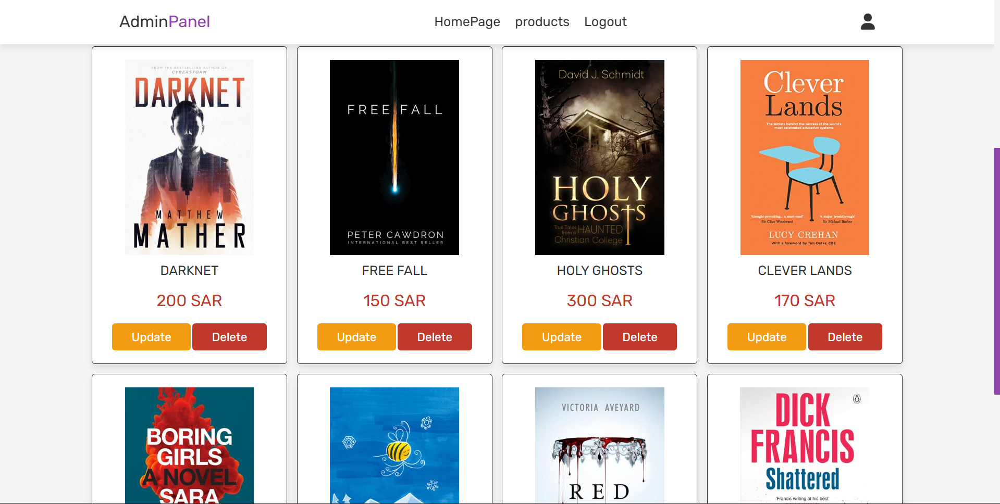
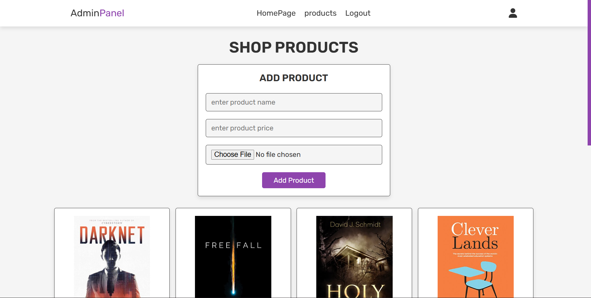

# Bookly: Electronic Book Store Application

**Bookly** is an electronic library project designed to display books online and sell them to users. The site is built as a transactional web application, allowing **public users** to browse available books and prices, while giving an **administrator** control over all inventory.

***

## Key Features and Interfaces

The project contains several pages, focused on two user roles: the public user (for browsing) and the site administrator (for management).

* **Home Page:** This is the main display page where all the books and short story books added by the administrator are dynamically displayed from the database table.

* **Login Page:** Provides secure access for the administrator to the site's management functions, requiring an e-mail and password.

* **Products Page:** This page is used by the administrator to manage inventory. Features include **adding a new book** to the database, **deleting** existing books, and initiating the process to **modify** book data.

* **Update Product Page:** Accessed via the Products Page, this interface allows the administrator to modify specific data for a book, including its **name**, **price**, and **image**.

***

## Technologies and Database Structure

The site was designed using several programming languages:

* **HTML (HyperText Markup Language):** Used to create the fundamental **structure** and tags for all pages on the site.
* **CSS (Cascading Style Sheets):** Used to **stylize** the elements and separate the content from the visual representation of the site.
* **PHP (Hypertext Preprocessor):** A general-purpose scripting language used primarily for **server-side scripting** and handling the logic between the site and the database.
* **MySQL:** Used to store all project data across two key tables:
    * **Table Users:** Stores credentials for the site administrator, including fields for the **Name**, **Email**, and **Password**.
    * **Table Products:** Stores all book data added by the site administrator, including fields for the book's **Name**, **Price**, and **Image**.
